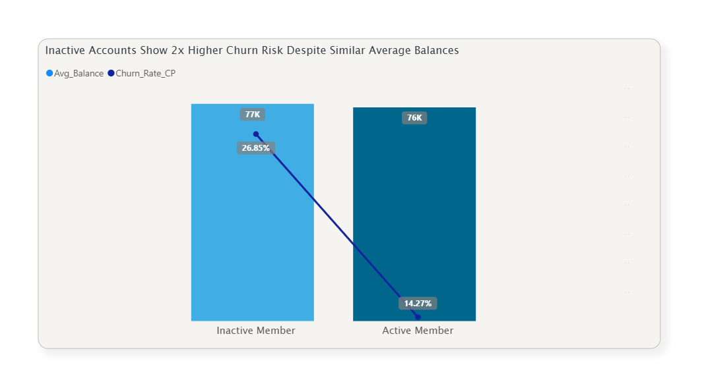
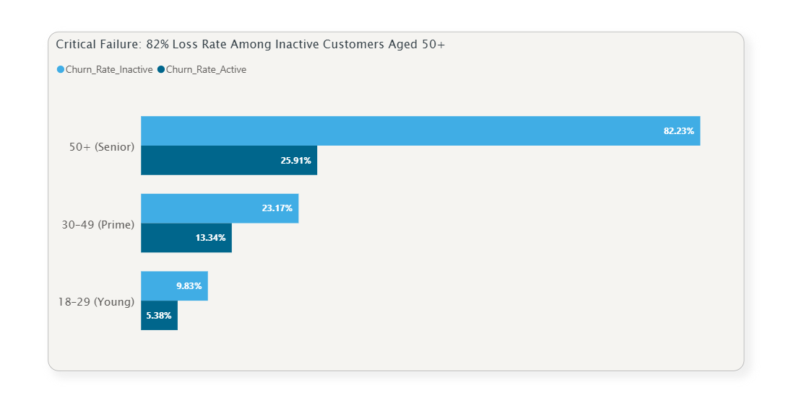
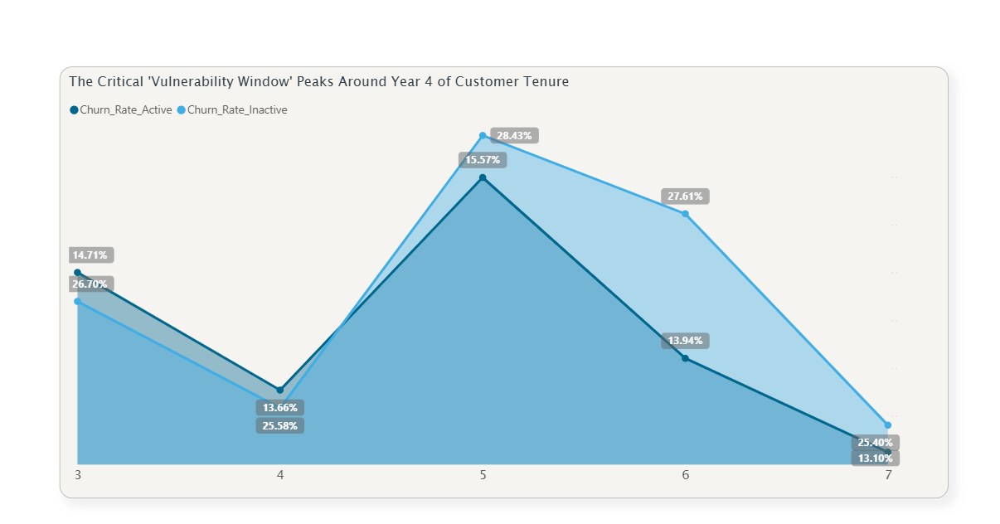
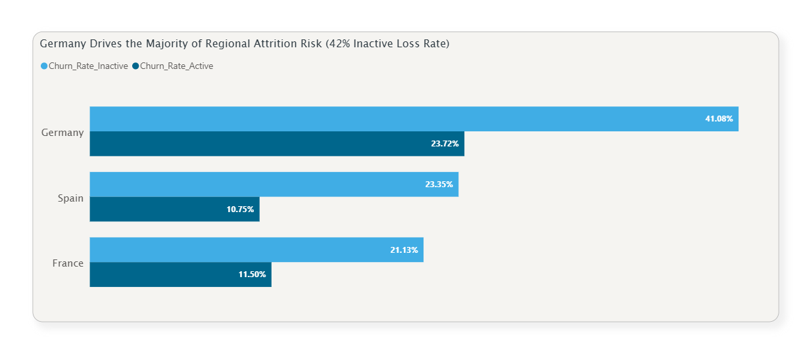
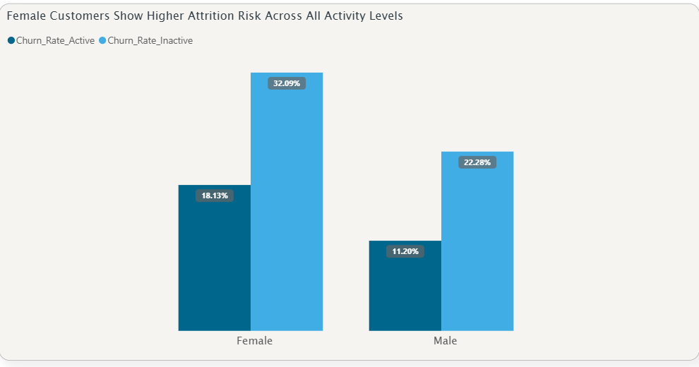
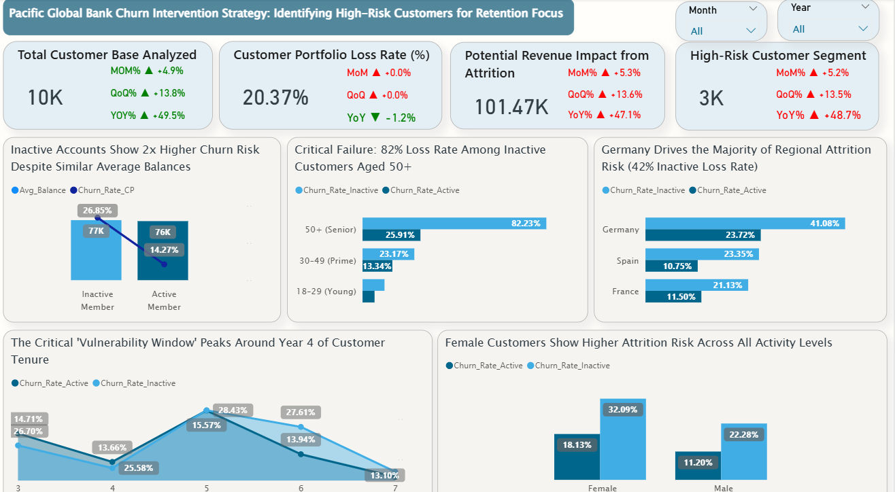

Yes, I am ready. I will improve the markdown formatting while keeping all your content exactly the same.

Here is your README with enhanced markdown formatting:

# 📊 Pacific Global Bank Customer Churn Intervention Strategy

A comprehensive data analysis project aimed at identifying high-risk customer segments and delivering targeted intervention strategies to minimize financial losses due to customer attrition.

---

## 📑 Table of Contents

1. [Overview](#1-overview)
2. [The Business Problem](#2-the-business-problem)
3. [Tools and Technologies](#3-tools-and-technologies)
4. [Project Structure](#4-project-structure)
5. [Research Portion and Key Findings](#5-research-portion-and-key-findings)
6. [Dashboard Interface Overview](#6-dashboard-interface-overview)
7. [Final Recommendations](#7-final-recommendations)
8. [Author and Contact](#8-author-and-contact)

---

## 1. Overview

This project successfully utilizes **Power BI** and **DAX (Data Analysis Expressions)** to move beyond general customer retention efforts. The core achievement is the identification and quantification of specific customer cohorts that represent the highest churn risk, allowing the bank to transform reactive efforts into proactive, focused strategies.

---

## 2. The Business Problem

Pacific Global Bank is experiencing significant and costly customer attrition, which negatively impacts overall growth and jeopardizes potential future revenue. The difficulty lies in deploying generic, inefficient retention efforts that fail to target the specific high-risk segments driving the most severe financial leakage.

The goal of this analysis was to **quantify the Revenue At Risk** and pinpoint the exact customer segments (by age, tenure, activity, and geography) that require immediate, focused intervention to maximize retention ROI.

---

## 3. Tools and Technologies

The analysis was executed using the following tools, with Power BI serving as the central platform for data modeling and visualization.

| Tool | Category | Description |
| :--- | :--- | :--- |
| **Power BI** | Visualization & Analysis | Utilized for data integration, developing the data model, and designing the intuitive, visual analytics dashboard. |
| **DAX** | Data Modeling | Employed for creating custom, complex measures (e.g., Churn Rate, Time Intelligence) and defining segmentation logic. |
| **Data Sources** | CSV, Excel | Primary datasets: `data/Bank_Churn.csv` and dimension tables. |

---

## 4. Project Structure

The repository is structured for easy navigation, with the analytical output and source data organized in dedicated folders.

```
E:\DA_Project\Customer_churn_analysis
├── code/
│   └── dax_measures_kpis.txt           <-- DAX measures
├── data/
│   ├── Bank_Churn.csv
│   ├── CustomerInfo.csv
│   └── (other data files...)
├── images/
│   ├── (All 6 visualization PNG files...)
├── bank_chrun_analysis.pdf             <-- Full Executive Report (PDF)
├── Customer_Churn_Analysis.pbix        <-- Power BI Source File
└── README.md                           <-- This main file
```

---

## 5. Research Portion and Key Findings

The comprehensive analysis identified five critical areas of customer behavior that drive attrition.

### 5.1 Engagement is the Primary Churn Predictor

Inactive accounts are significantly more prone to attrition compared to active accounts, regardless of the funds they hold. **Lack of engagement, not financial resources, is the most reliable predictor of future churn.**

> **Visual Evidence: Activity vs. Churn Rate**
> 

### 5.2 Critical Failure in Senior Inactive Segment

The combination of age (50+) and inactivity results in a near-total abandonment rate. This indicates a systemic failure to engage and retain older, non-active customers, demanding immediate personalized attention.

> **Visual Evidence: Critical Failure Age 50+ Churn Rate**
> 

### 5.3 The Critical Vulnerability Window

The customer lifecycle is marked by a period of heightened risk: The probability of churn peaks dramatically for customers who are nearing the **five-year mark** of their relationship with the bank. Pre-emptive action six months before this milestone is vital.

> **Visual Evidence: Churn by Customer Tenure**
> 

### 5.4 Geographic Concentration of Risk

The attrition risk is heavily concentrated in a single region: **Germany** exhibits a notably elevated churn rate compared to other regions, requiring a specific, localized retention strategy.

> **Visual Evidence: Geographic Churn Disparities**
> 

### 5.5 Gender Disparity in Inactive Cohorts

Inactive female customers show a higher propensity to churn than their male counterparts. This suggests a potential gap in product features or communication preferences unique to this demographic.

> **Visual Evidence: Gender Churn Disparities**
> 

---

## 6. Dashboard Interface Overview

The full Power BI dashboard provides the interactive metrics and quantitative context that supports all the findings in this report.

> **Visual Evidence (Main Dashboard View):**
> 

---

## 7. Final Recommendations

The following actionable strategies are recommended for immediate implementation:

1. **Senior Intervention:** Launch a dedicated "Personalized Service Check-in" campaign focused on low-friction, traditional communication (e.g., personal phone calls) for customers aged 50+ who are inactive.
2. **Geographic Focus:** Empower the German branch network with flexible loyalty and service offers to mitigate the concentrated regional risk.
3. **Lifecycle Retention:** Implement an automated workflow to trigger a "Relationship Milestone Review" contact six months prior to the five-year anniversary (the vulnerability window), offering customized loyalty incentives.

---

## 8. Author and Contact

This project was developed by:

### **Gagan C Holkar**

| Platform | Link |
| :--- | :--- |
| **LinkedIn** | [https://www.linkedin.com/in/gagan-holkar/](https://www.linkedin.com/in/gagan-holkar/) |
| **Email** | [gagancholkar@gmail.com](mailto:gagancholkar@gmail.com) |